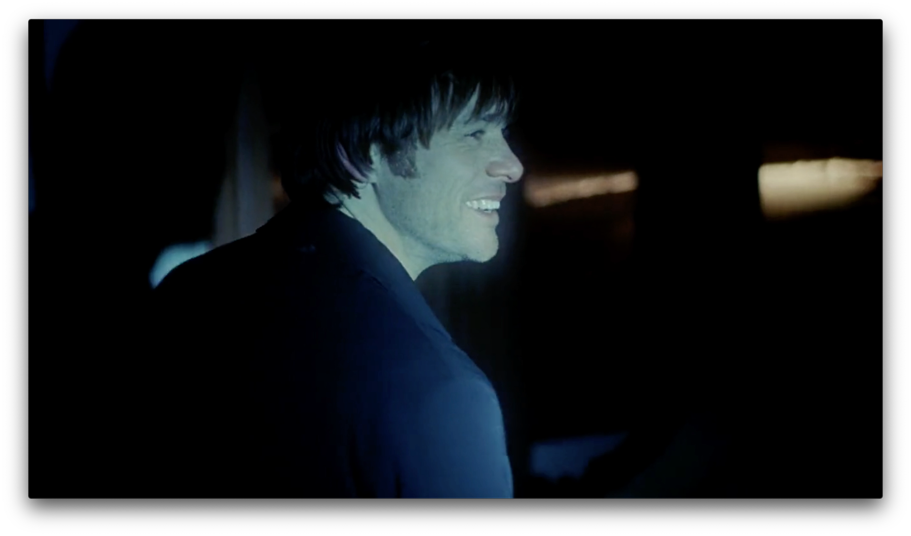

I just watched "Eternal Sunshine" for the second time. I feel differently about the movie this time. Surprisingly I like this frame: 

Having someone with whom you once felt so happy you could die being erased from your memory seems like a relief at first and unbearable once you realize how many happy memories are actually leaving you. It hurts me to see how Joel hurts Clem; assumptions building up to judgments eventually kill the image of the other person in your mind.

Some of the scenes I like:

- The scene with two kids: Baby girl in pink cow boy hat held baby Joel's hand and walked him out from the bullying kids. Then they went home, with baby Joel placing a pillow on the baby girl's face in front of the house. Baby Joel's mom saw them, both of them waved at her: We're just playin'! It's such a sweet scene.

- The scene at the end of the erasing procedure, with the beach house: 

> What if you'd stay this time?  Come back and make up a goodbye, at least.   Let's pretend we had one.

Let's pretend we had one. Shall we? Gosh, how much I cried on this line.

Joel told Clem that he was scared, that's why he walked out the door. She didn't know he was scared. He thought she knew that about him. It seems to me that this is the first time they were vulnerable with each other, and it happens to be at the end of their story, or at least the end of his memory about her that he wanted to erase. I noticed there is this one scene when Joel admitted to Clem that he was scared, he had a genuine, relieved, beautiful smile:

For a long time, I have had this habit in my head: Memories passing by, as if I'm on the train and I see them from the window, one after the other, or they're on the train, and I'm at the station watching them go by. Either way, they're passing right before my eyes. I see that exact kind of motion in "Eternal Sunshine," which is interesting to have your imagination actualized.

I realized I resisted the urge to fix these characters; I didn't want to change them. They just happened to be that way... 